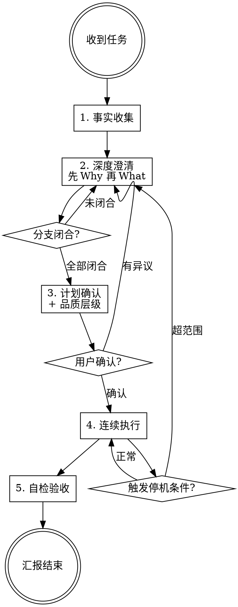

# Task Driver

> 重任务专用 skill。先深度澄清与细化计划，一次确认后连续执行到计划终点，自检收尾。

## 核心理念

**确认前移，执行后移；计划要细，执行要顺。**

大多数 agent 在两种极端之间摇摆：要么每走一步都问用户（低效），要么直接开干不停顿（容易跑偏）。Task Driver 的设计目标是——**把不确定性消灭在执行前，把连续性留给执行中**。

## 工作模式

收到任务后固定采用五阶段：

1. **事实收集** — 先查代码/文件/日志/现有 skill，消灭能自行确认的问题
2. **深度澄清** — 沿决策树逐层追问，**先 Why 再 What**，直到关键分支闭合
3. **计划确认** — 一次性确认目标、范围、品质层级、步骤、验收、边界
4. **连续执行** — 确认后直接做完整个计划，不停顿
5. **自检验收** — 对照验收标准逐项验证，汇报结果



## 使用方式

```
tdr- 你的任务描述
```

或

```
task-driver 你的任务描述
```

## 铁律（10 条）

| # | 铁律 | 一句话 |
|---|------|--------|
| 1 | 禁止把候选当确认 | 未明确确认的不得执行 |
| 2 | 禁止浅问即收手 | 必须追问到分支闭合 |
| 3 | 禁止执行阶段反复讨确认 | 确认后连续执行 |
| 4 | 禁止任务级猜测 | 能查的先查，只有用户独有的信息才问 |
| 5 | 多解必须在计划阶段解决 | 方案分歧不得拖到执行中 |
| 6 | 信息不足禁止出最终计划 | 缺关键信息就继续澄清 |
| 7 | 发现超范围或新分叉必须停 | 计划外变更必须暂停确认 |
| 8 | 先查再问，先证据再判断 | 自己能查到的不要问用户 |
| 9 | 禁止假完成 | 未验证不得说完成 |
| 10 | 目标未达成禁止结束 | 唯一结束条件：验收通过 |

## 深挖判定清单

澄清阶段必须闭合以下 12 项（每项有操作性定义），**先 Why 再 What**：

| 项目 | 判定标准 |
|------|----------|
| 为什么做（根本动机） | 能一句话说清用户场景和期望收益 |
| 做什么 | 能描述具体功能点 + 2-3 个关键子功能 |
| 为谁做 | 能描述目标用户场景和能力水平 |
| 解决什么问题 | 能说明痛点和解决后状态对比 |
| 做成什么样算好 | 用户确认品质层级 + 正面参考 |
| 输出物是什么 | 能列出交付物清单及格式 |
| 不做什么 | 能列出 2-3 个排除项 |
| 关键流程或交互 | 能描述主路径 3-5 个关键步骤 |
| 内容来源 | 能说明来源方式及质量保障 |
| 评价或验收方式 | 有可执行的验证步骤 |
| 约束与禁区 | 能列出技术限制和红线 |
| 优先级与可妥协项 | 能说明先砍什么、绝不砍什么 |

## 文件结构

```
task-driver/
  SKILL.md      # skill 定义文件（核心）
  CHANGELOG.md  # 版本说明
  README.md     # 本文件
```

## 版本

当前版本：v0.2.0

详见 [CHANGELOG.md](CHANGELOG.md)
